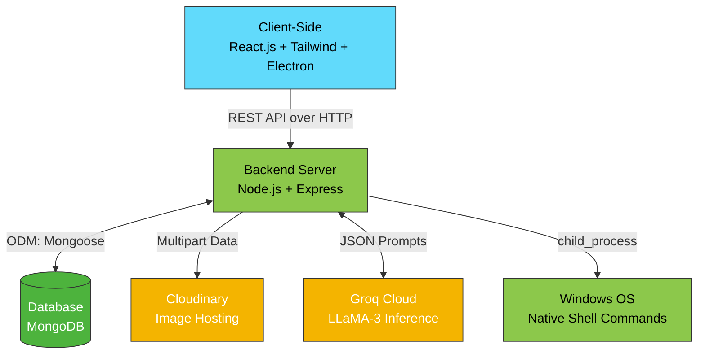

# 🎓 Full Stack Comprehensive Guide: Virtual Assistant Project

This documentation provides an exceptionally deep and comprehensive technical breakdown of the entire Virtual Assistant project. It is structured to help developers, examiners, and project stakeholders understand every layer of the architecture, including the frontend UI, backend server, database schemas, third-party libraries, and AI model orchestration.

---

## 🏗️ 1. Complete System Architecture

The project relies on a **Decoupled Client-Server Architecture** augmented with Native Desktop capabilities via Electron and Artificial Intelligence via the Groq Cloud.



---

## 🎨 2. Frontend Layer (Client-Side)

The frontend is a visually rich, voice-driven web interface that can also compile into an OS-level desktop widget via Electron. 

### Core Technologies
*   **React 19 & Vite**: The application is built using the latest React primitives and bundled via Vite for lightning-fast HMR (Hot Module Replacement). 
*   **Tailwind CSS v4**: Utility-first styling for dynamic, dark-themed visually striking interfaces.
*   **React Router DOM**: Handles client-side navigation between Authentication, Home, and Customization pages.
*   **Electron**: Enables the React app to run as a frameless, native Windows application with screen overlays (e.g., launching in a draggable Widget Mode).

### Key Components & Logic (`/frontend/src/`)
1.  **`Home.jsx` (The Brain Interface)**:
    *   **Speech Recognition**: Uses the native browser `window.SpeechRecognition` API. It continuously listens for the user's voice and triggers when it hears the localized `assistantName` trigger word.
    *   **Text & Image Input**: Allows manual text inputs and image uploads via `react-icons`. When submitting an image, it buffers it directly via `FileReader` to be sent to the AI.
    *   **Speech Synthesis**: Uses `window.speechSynthesis` to read back the AI's response aloud. It contains robust logic to filter and select different dynamic voice tones (e.g., Zira, Mark, David, and Hindi regional voices).
    *   **Dynamic Theming**: An array of over 10 complex CSS gradient themes that the user can cycle through to personalize the UI.
2.  **`DesktopIcon.jsx` (Widget Mode)**:
    *   A draggable, floating UI component when the app acts as an Electron application. It uses a custom `useEffect` mouse tracker hooked to `window.electronAPI.moveWindow` to reposition the physical desktop window natively.
3.  **`UserContext.jsx` (State Management)**:
    *   Provides global state management utilizing the Context API. It stores session data (`userData`), user preferences, and wraps the `axios` instance for HTTP communications.

---

## ⚙️ 3. Backend Layer (Server-Side)

The backend acts as a highly secure, asynchronous mediator between the User, OS, Database, and external AI processing units.

### Core Technologies
*   **Node.js & Express 5**: An asynchronous event-driven JavaScript runtime and web framework. Used to quickly scaffold highly scalable RESTful routes (`/api/auth` and `/api/user`).
*   **MongoDB & Mongoose**: NoSQL database for flexible data structures. Mongoose acts as the ODM (Object Data Modeling) tool.

### Library Implementations (`/backend/package.json`)
*   **`bcryptjs`**: Cryptographically hashes user passwords before saving them to the DB. Employs mathematically secure salt generation.
*   **`jsonwebtoken`**: Issues stateless authentication tokens (JWT) which are stored in secure `HTTPOnly` cookies, preventing XSS attacks.
*   **`multer` & `cloudinary`**: `multer` intercepts 'multipart/form-data' image uploads while Node.js streams them to `cloudinary`, returning a CDN link instead of bloating local MongoDB storage.
*   **`trash`**: Rather than permanently destroying files with `fs.unlink`, this safely moves user-deleted OS files to the Windows Recycle Bin.
*   **`child_process`**: The native Node.js library used to execute shell commands (`exec`) natively in the Windows Command Prompt.

### Database Schema (`user.model.js`)
*   Contains structured fields for authentication (Name, Email, passwordHash), Assistant aesthetics (assistantName, assistantImage), and crucially, a **History Array** (`[String]`) that logs every command invoked for contextual AI reasoning.

---

## 🧠 4. Artificial Intelligence & Groq Integration

The core intelligence mechanism lives within `/backend/groq.js`. The system does not use OpenAI directly, but rather the highly optimized Groq Cloud, running Meta's LLaMA architectures on LPUs (Language Processing Units) for near-zero latency.

### The Models
1.  **Text Processing (`llama-3.1-8b-instant`)**: This lightweight 8-Billion parameter LLaMA model processes pure textual conversational logic at hundreds of tokens per second.
2.  **Vision Processing (`llama-3.2-90b-vision-preview`)**: An immense 90-Billion multimodal model that drops in automatically if the request includes an `image` payload. It interprets the pixels and correlates them with the user's prompt.

### The Workflow (Context & Prompt Engineering)
1.  **The Context Array**: The backend pulls the last 8 entries from the user's conversation history (`history.slice(-8)`) and feeds it to the AI. If the user says "Delete it", the AI knows exactly what "it" was based on this history.
2.  **Instruction Set**: The `groqResponse` function issues a strict System Prompt overriding normal conversational habits. It demands the AI act as an OS Controller.
3.  **JSON Enforcement**: The prompt strictly tells the AI to return data in a parseable JSON schema block:
    ```json
    {
      "commands": [
        { "action": "open-app", "target": "Chrome" }
      ],
      "response": "I am opening Chrome for you now."
    }
    ```

---

## 💻 5. OS execution & Controller Methods (`user.controller.js`)

When the backend receives the parsed JSON object back from Groq, the `askToAssistant` method distributes the execution.

1.  **Frontend Proxies (Browsing & OS Navigation)**: 
    *   If the AI decides the command is `google-search`, `youtube-play`, `weather-show`, etc., the backend immediately mirrors these intents back to React.
    *   React reads the JSON and utilizes `window.open()` to process them natively inside the User Interface sandbox.
2.  **Deep OS Execution (`system.js`)**: 
    *   If the AI decides the command is `create-folder`, `delete-item`, or `open-app`, the Node backend steps in.
    *   Through the `child_process.exec()` library, dynamic switch cases construct physical terminal commands.
    *   *Example*: AI commands `{ "action": "create-folder", "target": { "location": "Desktop", "name": "Test" } }`. The backend translates this to a Windows Shell operation (`mkdir C:\Users\...\Desktop\Test`).

---

## 🛡️ 6. Full Lifecycle Example (A to Z)

**Scenario: User uploads an image of abstract art, clicks the Mic and says, "Change my aesthetic based on this image."**

1.  **Frontend**: `SpeechRecognition` intercepts the audio. `FileReader` encodes the image to Base64. `axios.post` dispatches both to `/api/user/asktoassistant`.
2.  **Backend Auth**: The `cookie-parser` reads the HTTPOnly cookie. Express middleware decodes the JWT to find the `userId`.
3.  **Database**: `user.controller.js` finds the user via Mongoose, pushes the query to the `history` array, and saves.
4.  **AI Layer**: `groq.js` intercepts that an image is present. It hot-swaps to the `llama-3.2-90b-vision-preview` model. It crafts the JSON prompt and calls Groq.
5.  **Response Generation**: Groq returns a JSON payload stating: `{"type": "general", "displayText": "# Abstract Art Analysis...", "response": "Absolutely, I have prepared an analysis of this image for you."}`
6.  **Transit**: Express routes the JSON schema back to the Client.
7.  **Frontend Render**: The `Home.jsx` state updates. The image unloads. `react-markdown` parses the `displayText` into rich HTML text blocks over the dark gradient theme.
8.  **Speech Synthesis**: `window.speechSynthesis` fires using the selected `voiceURI`, vocalizing the `response` string naturally back to the user.
